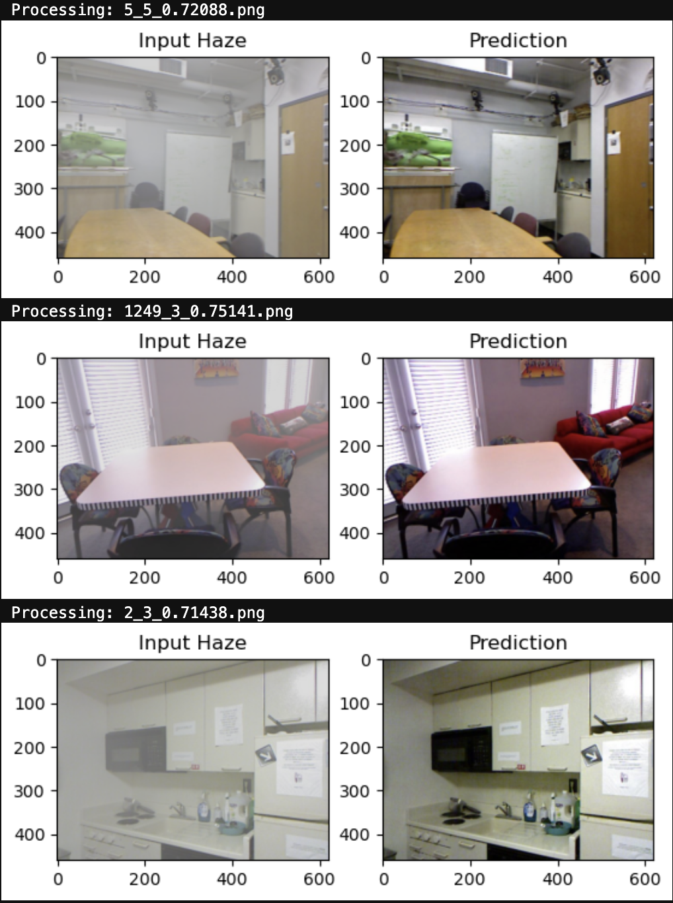

# Image_Dehazing-using-Multi-Attention-FFAnet (Clear Vision)
 
---------------------------------------------------------------

### A project made by **Aditya Singh**   and **Ramandeep Singh Makkar**  

in an Event **Clear Vision** hosted by *Center of Excellence in Artificial Intelligence for Education (CoE-AIE) at JUIT*

<h3 class="heading_test">A project made by 
**Aditya Singh**  and **Ramandeep Singh Makkar**  
</h3> in an Event <b> Clear Vision</b> hosted by <i>Center of Excellence in Artificial Intelligence for Education (CoE-AIE) at JUIT</i>.

---------------------------------------------------------------

Our proposed FFA model is trained on <a href="https://www.kaggle.com/datasets/balraj98/indoor-training-set-its-residestandard" target="_blank" rel="noopener noreferrer">RESIDE Dataset</a>

The results formulated below are from 
<i>Boyi Li, Wenqi Ren, Dengpan Fu, Dacheng Tao, Dan Feng, Wenjun Zeng, and Zhangyang Wang. 2019. Benchmarking Single-Image Dehazing and Beyond. Trans. Img. Proc. 28, 1 (Jan. 2019), 492–505. https://doi.org/10.1109/TIP.2018.2867951<i>

|Models|Indoor(PSNR/SSIM)|
|-|-|
|DCP|16.62/0.8179|
|AOD-Net|19.06/0.8504|
|DehazeNet|21.14/0.8472|
|GFN|22.30/0.8800|
|GCANet|30.23/0.9800|
|Ours|36.07/0.9874|

Since working with only CPU, we are yet to refine the model more and make our results best.
Below are the results of our model:

#### Also we have created the flask website for the same, It might stop working after January 2025 as its subscription will end,
#### so we have recorded the working of our website below (takes some time to load):

This is our browse option:

We also have added sample images to process directly:

